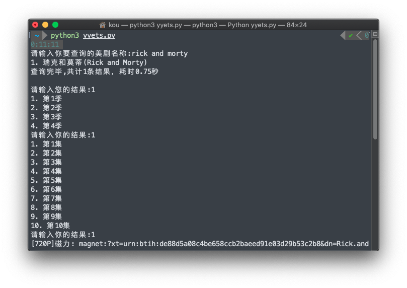

# yyets_search
Python写的用来查询人人影视的小工具(配合sqlite3)

## 截图


## 使用需要：
+ sqlite3
+ yyets.db(即数据库文件)
+ python3
   + 依赖包：
      + sqlite3
      + json
      + os
      + time

## 使用指南(Linux)：
0. (可选)建立索引：
   + 输入指令：
   ```bash
   sqlite3 你的数据库地址/yyets.db
   ```
   + 输入sql命令：
   ```sql
   CREATE INDEX index_name ON resource (name);
   ```
1. 下载Python代码：
```bash
wget https://raw.githubusercontent.com/Koukotsukan/yyets_search/main/src/yyets.py
wget https://raw.githubusercontent.com/Koukotsukan/yyets_search/main/src/requirements.txt
```
2. (可选)输入指令安装Python依赖：
```bash
pip3 install -r requirements.txt
```
3. 运行查询程序：
```bash
python3 yyets.py
```
4. (仅第一次使用时)键入数据库文件的绝对地址

## 免责声明
数据结构来自于网络
